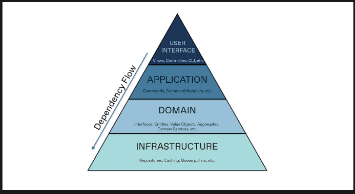

# Tài liệu Thiết kế Hệ thống Event Management (DDD)

## 1. Danh sách các Bảng và Thuộc tính

### Module: Identity & Access Management (IAM)
*   **users**: Quản lý thông tin tài khoản người dùng (Admin, Organizer, Staff, Customer).
    *   `id` (PK): Long
    *   `username`: String (Unique)
    *   `email`: String
    *   `password`: String
    *   `full_name`: String
    *   `phone`: String
    *   `address`: String
    *   `enabled`: Boolean
    *   `verification_token`: String
    *   `otp`: String
    *   `otp_expiry`: LocalDateTime
    *   `organizer_id` (FK): Liên kết Staff với Organizer.
    *   `created_at`, `updated_at`: Metadata.
*   **roles**: Phân quyền hệ thống.
    *   `name` (PK): String (ADMIN, ORGANIZER, STAFF, CUSTOMER)
    *   `description`: String
*   **permissions**: Các quyền chi tiết.
    *   `name` (PK): String
    *   `description`: String
*   **invalidated_tokens**: Lưu vết các token đã đăng xuất.
    *   `id` (PK): String (JTI)
    *   `expiry_time`: Date

### Module: Event Management
*   **categories**: Danh mục sự kiện.
    *   `id` (PK): Long
    *   `name`: String
    *   `description`: String
*   **events**: Thông tin chi tiết sự kiện.
    *   `id` (PK): Long
    *   `name`: String
    *   `category_id` (FK): Liên kết danh mục.
    *   `organizer_id` (FK): Người sở hữu sự kiện.
    *   `location`: Địa chỉ cụ thể.
    *   `province`: Tỉnh/Thành phố (dùng để lọc).
    *   `start_time`, `end_time`: Thời gian diễn ra.
    *   `sale_start_date`, `sale_end_date`: Thời gian bán vé.
    *   `description`: TEXT (Mô tả chi tiết).
    *   `status`: Enum (PENDING, UPCOMING, OPENING, CLOSED, COMPLETED, CANCELLED).
*   **event_images**: Slide ảnh mô tả (Tối đa 5 ảnh).
    *   `id` (PK): Long
    *   `event_id` (FK)
    *   `image_url`: String

### Module: Ticket & Inventory
*   **ticket_types**: Cấu hình loại vé (VIP, Standard...).
    *   `id` (PK): Long
    *   `event_id` (FK)
    *   `name`: String
    *   `price`: BigDecimal
    *   `total_quantity`: Integer
    *   `remaining_quantity`: Integer (Theo dõi tồn kho).
    *   `description`: String

### Module: Booking & Sales
*   **carts**: Giỏ hàng tạm thời.
    *   `id` (PK): Long
    *   `customer_id` (FK): Mỗi customer có 1 giỏ hàng.
*   **cart_items**: Chi tiết vé trong giỏ.
    *   `id` (PK): Long
    *   `cart_id` (FK)
    *   `ticket_type_id` (FK)
    *   `quantity`: Integer
*   **orders**: Thông tin đơn hàng đã thanh toán.
    *   `id` (PK): Long
    *   `customer_id` (FK)
    *   `total_amount`: BigDecimal (Sau giảm giá).
    *   `discount_amount`: BigDecimal
    *   `service_fee`: BigDecimal (Phí sàn).
    *   `organizer_amount`: BigDecimal (Tiền BTC nhận được).
    *   `voucher_code`: String
    *   `payment_method`: Enum
    *   `payment_status`: Enum
    *   `order_status`: Enum
    *   `order_date`, `paid_at`: Thời gian.
*   **order_items**: Chi tiết vé trong đơn hàng.
    *   `id` (PK): Long
    *   `order_id` (FK)
    *   `ticket_type_id` (FK)
    *   `quantity`: Integer
    *   `unit_price`: BigDecimal
*   **tickets**: Vé điện tử (Digital Ticket) được sinh ra sau khi Order thành công.
    *   `id` (PK): Long
    *   `order_id` (FK)
    *   `ticket_type_id` (FK)
    *   `ticket_code`: String (Unique - Dùng để check-in).
    *   `qr_code`: String (Link ảnh/data QR).
    *   `status`: Enum (VALID, USED, EXPIRED).
    *   `used_at`: LocalDateTime.

### Module: Marketing
*   **vouchers**: Mã giảm giá.
    *   `id` (PK): Long
    *   `code`: String (Unique)
    *   `amount`: BigDecimal
    *   `discount_type`: Enum (PERCENTAGE, AMOUNT)
    *   `min_order_amount`: BigDecimal
    *   `max_discount`: BigDecimal
    *   `start_date`, `end_date`: Hiệu lực.
    *   `quantity`: Integer
    *   `event_id` (FK): Null nếu là Voucher toàn sàn.
    *   `creator_id` (FK): Admin hoặc Organizer.

---

## 2. Quan hệ giữa các Thuộc tính

*   **User & Role**: Many-to-Many (Một người có thể có nhiều Role và ngược lại).
*   **Event & Category**: Many-to-One (Nhiều sự kiện thuộc 1 danh mục).
*   **Event & EventImage**: One-to-Many (1 sự kiện có nhiều ảnh mô tả).
*   **Event & TicketType**: One-to-Many (1 sự kiện có nhiều loại vé khác nhau).
*   **Order & OrderItem**: One-to-Many (1 đơn hàng có nhiều loại vé).
*   **Order & Ticket**: One-to-Many (1 đơn hàng sinh ra nhiều vé điện tử tương ứng với số lượng mua).
*   **Organizer & Staff**: One-to-Many (Một Organizer quản lý nhiều nhân viên soát vé thông qua `organizer_id` trong bảng `users`).
*   **Voucher & Event**: Many-to-One (Voucher có thể áp dụng cho 1 sự kiện cụ thể hoặc toàn bộ hệ thống).

---

## 3. Cấu trúc thư mục Kiến trúc hướng miền (DDD)

Sơ đồ kiến trúc tổng quan:


Sắp xếp theo Bounded Contexts để tách biệt nghiệp vụ:

```text
src/main/java/com/sa/event_mng
├── modules
│   ├── identity          (Identity & Access Context)
│   │   ├── domain        (Entities, Aggregates, Repository Interfaces, Domain Services)
│   │   ├── application   (Use Cases, DTOs, Application Services)
│   │   └── infrastructure (Persistence Repositories, Security Config)
│   ├── event             (Event Context)
│   │   ├── domain
│   │   ├── application
│   │   └── infrastructure
│   ├── ordering          (Order & Cart Context)
│   │   ├── domain
│   │   ├── application
│   │   └── infrastructure
│   ├── ticketing         (Digital Ticket Context)
│   │   ├── domain
│   │   ├── application
│   │   └── infrastructure
│   └── marketing         (Promotion & Voucher Context)
│       ├── domain
│       ├── application
│       └── infrastructure
├── shared
│   ├── domain            (BaseEntity, ValueObjects dùng chung)
│   ├── dto               (ApiResponse, Global DTOs)
│   ├── exception         (Global Exception Handling)
│   └── infrastructure    (Email, PDF, Cloudinary)
│       └── config        (General Technical Configs)
```

### Cấu trúc chuẩn cho một Module:
```text
com.sa.event_mng.modules.[module_name]
├── presentation            (Tầng Giao diện - User Interface)
│   └── controller          (Nơi chứa @RestController, nhận HTTP Request)
├── application             (Tầng Ứng dụng - Application Layer)
│   ├── service             (Điều phối nghiệp vụ, quản lý @Transactional)
│   ├── dto                 (Data Transfer Objects: Request/Response)
│   └── mapper              (Chuyển đổi Entity <-> DTO, ví dụ: MapStruct)
├── domain                  (Tầng Nghiệp vụ lõi - Trái tim của module)
│   ├── model               (Chứa Entities, Enums, Value Objects)
│   └── repository          (Chứa các INTERFACE của Repository)
└── infrastructure          (Tầng Hạ tầng - Infrastructure Layer)
    ├── security            (Cấu hình bảo mật đặc thù như SecurityConfig, JwtDecoder)
    ├── persistence         (Cài đặt chi tiết Repository nếu cần)
    └── config              (Các cấu hình kỹ thuật khác)
```

---

## 4. Tình trạng dự án

### ĐÃ HOÀN THÀNH:
*   **Module hóa**: 5 miền nghiệp vụ chính (identity, event, ordering, ticketing, marketing) đã được tách biệt hoàn toàn vào folder `modules`.
*   **Shared Kernel**: Logic dùng chung Exception, Config, DTO và BaseEntity đã được đưa vào folder `shared`.

### CHƯA LÀM:
*   **Viết lại Seeders**: Hệ thống tạo dữ liệu mẫu đang tạm dừng (đang lười seed).
*   **Dọn dẹp file cũ**: Các folder cũ ở root cần được xóa hẳn (Delete) để tránh nhầm lẫn.
*   **Enums đặc thù**: Một số Enum vẫn đang nằm ở `model.enums`. Cần đưa về đúng domain module (VD: `EventStatus` về module `event`) để tăng tính đóng gói.
